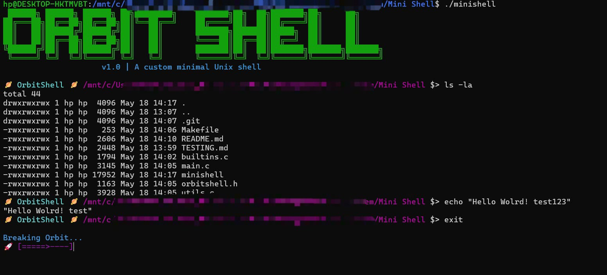

# 🪐 OrbitShell



A lightweight, customized Unix mini-shell built entirely in C from scratch. 

OrbitShell is an educational systems programming project designed to strip down the core mechanics of a Unix shell into a minimalistic, memory-safe, and highly modular architecture. It demonstrates a fundamental understanding of POSIX system calls, process management, and dynamic memory allocation, all wrapped in a personalized, futuristic aesthetic.

---

## Features

* **Custom Aesthetic Engine**: Launches with a massive, vibrant green ASCII art banner and features a stylized prompt (`🪐 OrbitShell 🪐 /path $>`) that updates dynamically.
* **Modular Architecture**: Built following best practices for C projects (separated into header, utils, builtins, and main execution files).
* **Strict C89 Compliance**: Compiled using `-std=gnu89` with rigorous compilation flags (`-Wall -Wextra -Werror -pedantic`).
* **Zero Memory Leaks**: Thoroughly managed dynamic memory allocation via custom wrappers. Input lines and token arrays scale infinitely without arbitrary buffer limits.
* **POSIX Process Execution**: Executes system commands seamlessly via robust `Fork()`, `Execvp()`, and `Wait()` wrapper functions that safely catch kernel errors.
* **Signal Handling**: `Ctrl+C` returns the parent shell to a fresh prompt while still interrupting foreground child processes.
* **I/O Redirection & Pipelines**: Supports `<`, `>`, `>>`, and `|` for everyday command composition.
* **Custom Built-ins**:
  * `cd`: Directly alters the parent process's environment, including `cd`, `cd ~`, `cd -`, `PWD`, and `OLDPWD`.
  * `env`: Prints the global environment array.
  * `exit`: Gracefully frees all memory and triggers a custom **"Breaking Orbit..."** loading animation before shutting down.

---

## Installation & Compilation

OrbitShell utilizes Unix-specific system calls (`fork`, `execvp`, `wait`) and requires a Linux environment (like Ubuntu or WSL on Windows) to compile and run.

### 1. Install Dependencies
You need the standard C compilation toolchain (`gcc` and `make`).
On Ubuntu/WSL:
```bash
sudo apt update
sudo apt install build-essential
```

### 2. Compile
Navigate to the root of the project directory and run the Makefile:
```bash
make
```
*(If successful, you will see a green `Compilation Ok!` message).*

---

## Usage

Launch the shell by running the compiled executable:
```bash
./minishell
```

### Example Commands
Once inside OrbitShell, you can run any standard commands available on your system, or test the built-ins:
```bash
OrbitShell $> ls -la
OrbitShell $> pwd
OrbitShell $> echo "Hello from OrbitShell!"
OrbitShell $> cd /tmp
OrbitShell $> cd -
OrbitShell $> echo hello > output.txt
OrbitShell $> cat < output.txt
OrbitShell $> echo hello | wc -w
OrbitShell $> env
```

To exit the shell and see the custom shutdown animation, simply type:
```bash
OrbitShell $> exit
```
*(Or press `Ctrl+D` to send an EOF signal).*
